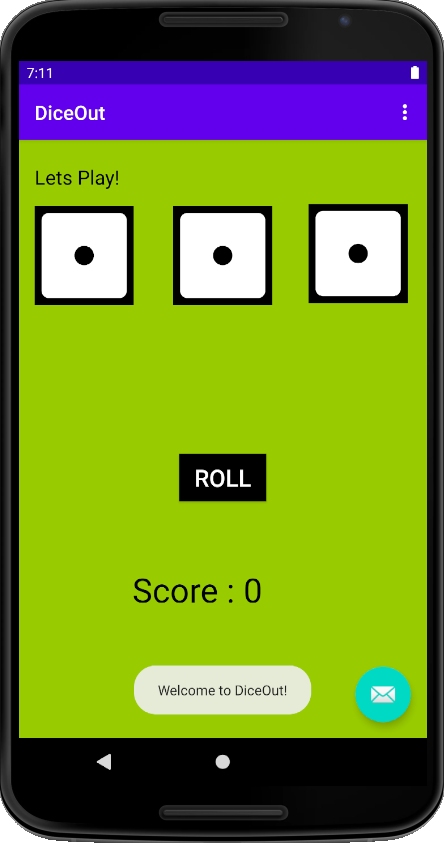
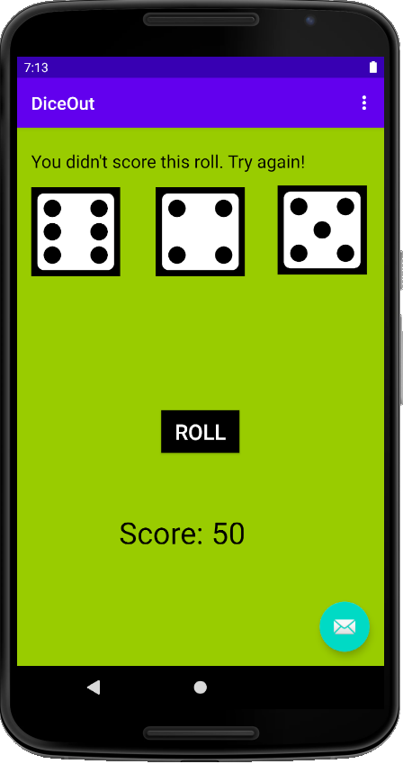
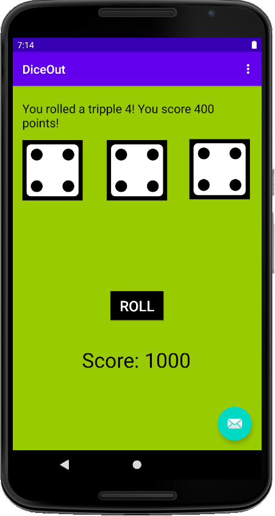

# Android-DiceOut-Game
A simple dice-rolling game app for Android, including Java, XML, and the Android SDK. I learnt Connecting XML widgets to code, Adding images, 
Adding game logic with conditional statements and operators, and Changing the data or design.

# App Snapshots

1) Initial game display

2) When 2 dice match, its a score of 50

3) When no dice match, player is asked to try again

4) When all the dice match, the number on the die multiplied by 100 is the score

